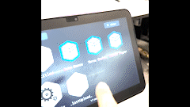

# pepper-demo

Read the Pepper Documentation [here](http://doc.aldebaran.com/2-5/home_pepper.html). 

# Important Notice

## Booking
To utilize Pepper, please follow the steps below:

1. Access the provided [Google Sheet](https://docs.google.com/spreadsheets/d/1A1fpoGiZkxSSyUQTw30FwyKJTGMPZquZ3-cTsPa1pf4/edit?usp=sharing).
2. Fill in your name, date/time of usage, return date/time, and any additional notes.
3. Additionally, if you encounter any issues while using Pepper, please promptly report them in the designated section of the Google Sheet. Your feedback is valuable in ensuring the optimal performance and functionality of Pepper for all users.

Thank you for your cooperation in using Pepper effectively.

To use Pepper, please follow the steps below:


2. Locate the booking section.

4. Submit the form to secure your booking.

Note: Ensure that you adhere to the booking process and provide accurate information to facilitate a smooth experience for everyone interested in using Pepper.

## Pepper's head 
After usage, please ensure to turn off Pepper completely and position its head in an upright position. Failure to do so may result in damage to Pepper's neck.

 >>>>>


## Detaching the Charger
Always ensure that Pepper is turned off before disconnecting the charger. It is important not to disconnect the charger while Pepper is powered on.

# Daily Use
Here are convenient links to engage with Pepper quickly:
- [Turning Pepper on](http://doc.aldebaran.com/2-5/family/pepper_user_guide/turn_on_pep.html)
- [Interacting with Pepper](http://doc.aldebaran.com/2-5/family/pepper_user_guide/interacting_pep.html)
- [Launching / exiting an Activity](http://doc.aldebaran.com/2-5/family/pepper_user_guide/activity_pep.html)
- [Putting Pepper to sleep](http://doc.aldebaran.com/2-5/family/pepper_user_guide/sleep_pep.html)
- [Switching Autonomous life on and off](http://doc.aldebaran.com/2-5/family/pepper_user_guide/freeze_pep.html)
- [Turning Pepper off](http://doc.aldebaran.com/2-5/family/pepper_user_guide/turn_off_pep.html)
- [Requesting technical information](http://doc.aldebaran.com/2-5/family/pepper_user_guide/request_pep.html)
- [Charging the battery](http://doc.aldebaran.com/2-5/family/pepper_user_guide/battery-charging_pep.html)

To access further information, kindly visit [this link](http://doc.aldebaran.com/2-5/family/pepper_user_guide/interacting.html).


# Running Demos

Follow these steps to run demos with Pepper:

## Turn on the Pepper
1. Press the button on chest.
2. Wait for Pepper to finish the initialization motion.
3. Touch the tablet located on Pepper's chest.
4. Select the desired app to demonstrate.


## Demo 1: Date Dance
To enjoy a dance performance with Pepper:
1. Interact with the tablet located on Pepper's chest to access the applications.
2. Locate and choose the 'Date Dance' option to initiate the dance with music.


## Demo 2: Story
Pepper engages in storytelling using expressive gestures.
1. Interact with the tablet located on Pepper's chest to access the applications.
2. Locate and choose the 'Three Muske..' option to initiate the dance with music.



## Demo 3: Tickle Pepper
Pepper responds to interactions by tickling the tablet.
1. Interact with the tablet located on Pepper's chest to access the applications.
2. Locate and choose the 'Tickle Pepper' option to initiate the dance with music.


## Turn off Pepper
Press and hold the Chest Button for 3 seconds, until the robot says “GNUK GNUK”. The shutdown process is completed when all the LEDs are off.

## Move Pepper
To prepare Pepper for transportation to the demonstration area:

1. Power off Pepper completely and disconnect the charger cable.
2. Ensure Pepper's head is in an upright position.
3. Carefully push Pepper or use a trolley to transport it to the demonstration place.

# For developers
Read the NAOqi documentation [here](http://doc.aldebaran.com/2-5/index_dev_guide.html)

## Pepper Device Info
- Pepper version: 1.8
- IP Address: 172.22.1.21 (SSID: UoA-Device)


## Installing Choregraphe Suite
To install Choregraphe Suite, follow these steps:
1. Download [choregraphe-suite-2.5.10.7-linux64](https://drive.google.com/file/d/16h7xRx261XC9tK4yoNY1_Avj20tYhjY5/view?usp=sharing)
2. Unzip the downloaded file.
3. Run Choregraphe.
```
cd choregraphe-suite-2.5.10.7-linux64
./choregraphe
```

If you encounter the following error while running Choregraphe, 

```
/opt/Softbank Robotics/Choregraphe Suite 2.5/bin/../lib/../lib/../lib/libz.so.1: 
version `ZLIB_1.2.9' not found (required by /usr/lib/x86_64-linux-gnu/libpng16.so.16)
```

please execute the steps below:

```
cd "/opt/Softbank Robotics/Choregraphe Suite 2.5/lib/"
sudo mv libz.so.1 libz.so.1.old
sudo ln -s /lib/x86_64-linux-gnu/libz.so.1
```


## Setup python environment
[Install miniconda](https://docs.conda.io/projects/conda/en/latest/user-guide/install/linux.html) and create a conda environment. 
```
conda create -n pepper27 python=2.7
conda activate pepper27
```
In order to install pynaoqi, download [pynaoqi-python2.7-2.5.7.1-linux64](https://drive.google.com/file/d/1ZWqaU_Nl8o9mUi5FKYq-1XmsfRwDUgX3/view?usp=drive_link), and unzip it into userhome(/home/username)

Then, add the path to PYTHONPATH to use naoqi in your script.

```
export PYTHONPATH=${PYTHONPATH}:/home/username/pynaoqi-python2.7-2.5.7.1-linux64/lib/python2.7/site-packages
```
Or you can add the path in the script. 
```
import sys
sys.path.insert(0, '~/pynaoqi-python2.7-2.5.7.1-linux64/lib/python2.7/site-packages')
```

Try to import naoqi.
```
import naoqi
```
If there is no error, it's ready to use the sdk. 

# References
[Aldebaran Docs](http://doc.aldebaran.com/index.html)
